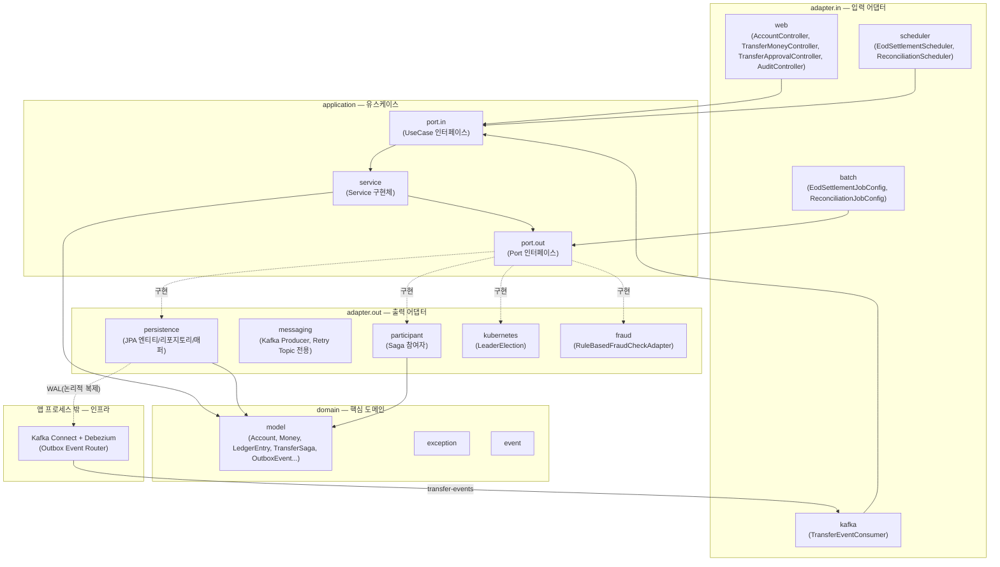

# FBRL (Financial Backend Reliability Lab)

금융 거래의 **신뢰성**, **분산 동시성 제어**, **장애 복구 메커니즘**을 직접 구현하고 검증하기 위한 백엔드 실험 플랫폼입니다. 실제 서비스가 아니라, 분산 락·Saga·EOD 배치·Kafka 재시도/CDC 기반 이벤트 발행 등 금융 백엔드에서 요구되는 신뢰성 패턴을 헥사고날 아키텍처 위에서 검증하는 것이 목적입니다.

## 기술 스택

| 구분 | 기술 |
|---|---|
| Language | Java 17 |
| Framework | Spring Boot 4.0.7 |
| Architecture | 헥사고날 아키텍처 (Ports & Adapters) |
| Database | PostgreSQL 16 (wal_level=logical) |
| Cache / 분산 락 | Redis 7.2, Redisson |
| Messaging | Apache Kafka 3.9.0 (KRaft) |
| CDC | Debezium 3.0.0.Final + Kafka Connect (PostgreSQL 논리적 복제 기반 Outbox Event Router) |
| Batch | Spring Batch 6.0.4 |
| 분산 스케줄링 | ShedLock 7.7.0, Kubernetes Lease API (client-java 27.0.0) |
| 관측성 | Micrometer Tracing (OpenTelemetry bridge), Jaeger (로컬 트레이스 뷰어, OTLP 수신) |
| API 문서화 | springdoc-openapi (Swagger UI) |
| Build | Gradle |

## 아키텍처

의존성은 항상 바깥(adapter)에서 안쪽(domain)으로만 흐릅니다. domain은 프레임워크에 의존하지 않습니다.



## 3개 트랙별 핵심 기능

### 트랙 1 — 실시간 트랜잭션 & 분산 동시성 제어
- Redisson 분산 락 (`@DistributedLock` AOP, REQUIRES_NEW 트랜잭션 분리)
- API 멱등성 (Redis SETNX 기반 `@CheckIdempotency`)
- Transactional Outbox 패턴 + Debezium CDC 기반 발행 (PostgreSQL 논리적 복제, 폴링 없이 WAL 기반으로 실시간에 가깝게 Kafka 발행)
- 해시체인 기반 불변 감사로그 (`OutboxEvent`가 직전 항목의 SHA-256 해시를 포함, `outbox_chain_tail` 단일 행 `SELECT ... FOR UPDATE`로 동시 삽입 시 체인 분기 방지, `GET /api/v1/audit/verify`로 전체 체인 무결성 검증)
- Saga 오케스트레이션 (`TransferSaga` 상태 머신 + 보상 트랜잭션, Choreography 대신 Orchestration 채택) — **구현·테스트 검증은 완료됐으나 어떤 컨트롤러에도 연결되어 있지 않아 실제 라이브 이체 경로가 아님**. 실제 이체(`POST /api/v1/transfers` 및 Maker-Checker 승인 후 집행)는 아래 복식부기 원장 기반 `TransferMoneyService`가 처리하며, `TransferSagaOrchestrator`/`StartTransferSagaUseCase`는 통합 테스트에서만 실행됩니다.
- 복식부기 원장(`LedgerEntry`, append-only) — 계좌 잔액을 저장 필드가 아닌 원장 합산 파생값(SSOT)으로 전환, 거래 단위 대차평형은 `LedgerEntry.transferPair`로 구조적 보장
- 분산 트레이싱 (Micrometer Tracing + OpenTelemetry bridge) — HTTP 요청 → Saga 각 단계 → Outbox 저장 → Debezium CDC → Kafka Consumer(재시도 토픽 포함)까지 하나의 trace_id로 연결. Outbox 전용 컬럼(`trace_id`/`span_id`)에 담아 Debezium EventRouter SMT로 Kafka 헤더에 실어 전파(감사로그 해시체인 계산 대상에서는 제외)
- Maker-Checker(이중 승인, 4-eyes principle) — 금액 threshold 이상 이체는 `TransferMoneyController`에서 즉시 차단되고, `TransferApprovalController`(`/api/v1/transfer-approvals`)를 통한 별도 기안(Maker)/승인(Checker) 절차를 거쳐야만 실제 자금 이동이 시작됨. 승인 워크플로 상태(`status`)와 실제 자금 이동 결과(`executionStatus`)는 별도 필드로 분리되어 있어, 승인 후 집행이 실패해도(이상거래 탐지 등) "승인 행위가 있었다"는 사실과 "그 집행은 실패했다"는 사실을 각각 명시적으로 확인할 수 있음
- 룰 기반 이상거래 탐지 (`FraudCheckPort`) — 단건 금액이 threshold를 초과하면 `SuspiciousTransferException`으로 이체를 즉시 차단. `TransferMoneyService.transfer()` 내부(기존 `@DistributedLock` 안쪽)에 위치해, 직접 이체(`TransferMoneyController`)와 Maker-Checker 승인 후 트리거(`ApproveTransferService`) 두 경로 모두에서 우회 없이 적용됨

### 트랙 2 — EOD 대규모 정산 배치
- Spring Batch 6.0.4 Chunk-oriented EOD 정산 Job (계좌별 일할 이자 계산 및 마감 스냅샷 저장)
- ShedLock 기반 다중 인스턴스 스케줄러 중복 실행 방지
- Kubernetes Lease API 기반 리더 선출 연동 (`k8s.leader-election.enabled` 플래그, 기본 비활성화 — kind/kubeconfig 없는 환경에서도 기존 테스트가 깨지지 않도록 조건부 활성화)
- 시스템 전체 대차평형(trial balance) 검증 배치 스텝 — 매일 EOD 마감 시 전체 `LedgerEntry` 차변/대변 합을 대조해 불일치 시 배치 실패로 알림
- EOD 정산 대사(Reconciliation) 엔진 — `eodSettlementJob`과 분리된 별도 Job(`ReconciliationJobConfig`)으로, 계좌별 `EodSnapshot`(오늘자, 이자 제외 `closingBalance`)과 `LedgerEntry` 전량 재계산 결과를 대조해 `MISMATCH`/`NO_SNAPSHOT`을 `reconciliation_discrepancies`에 기록(일치 건은 저장하지 않음). trial balance(시스템 전체 SUM=0)와는 검증 레벨이 달라 중복이 아님 — 계좌 단위로 EodSnapshot 앵커 캐시 자체의 정합성을 검증

### 트랙 3 — 장애 복구 & 복원력
- Kafka Consumer Non-blocking Retry Topic + DLT (결정론적 실패는 즉시 DLT로, 일시적 실패는 지수 백오프 재시도)
- Chaos Mesh 기반 결함 주입은 **Infra 담당(김준희) 영역**이며 이 리포지토리의 범위 밖입니다. 백엔드는 "어떤 장애 시나리오로 무엇을 검증할지" 정의와 장애 주입 후 애플리케이션 반응 검증을 담당합니다.

## 관리자 조회 API

관리자 프론트엔드용 읽기 전용 조회 API 6종(엔드포인트 기준 7개)입니다. 전부 로그인(`POST /api/v1/auth/login`) 후 발급받은 JWT로 인증이 필요합니다. 페이지네이션은 공통으로 `page`(0-base)/`size` 쿼리 파라미터 + `{content, totalElements, page, size, totalPages}` 응답 형태를 씁니다.

> 인증에는 `ADMIN`/`DEMO` 두 역할이 있습니다. 이 표의 엔드포인트는 전부 `ADMIN` 역할만 접근 가능합니다 — 역할별 접근 제어는 [데모 환경](#데모-환경) 섹션 참고.

| # | 엔드포인트 | 설명 | 필터 파라미터 |
|---|---|---|---|
| 1 | `GET /api/v1/transfer-approvals` | 승인 요청 이력(전체 상태) | `status`(선택), `from`/`to`(Instant, 필수) |
| 2 | `GET /api/v1/reconciliation-discrepancies` | Reconciliation 불일치 목록 | `status`(선택), `from`/`to`(LocalDate, 필수) |
| 3 | `GET /api/v1/accounts/{accountNumber}/ledger-entries` | 계좌별 원장 조회 | `from`/`to`(Instant, 필수) |
| 4 | `GET /api/v1/accounts/{accountNumber}/eod-snapshots` | 계좌별 EOD 스냅샷 히스토리 | `from`/`to`(LocalDate, 선택) |
| 5 | `GET /api/v1/eod-snapshots` | 날짜별 전체 계좌 EOD 스냅샷 | `date`(LocalDate, 필수) |
| 6 | `GET /api/v1/batch-jobs/{jobName}/executions` | 배치 Job(`eodSettlementJob`/`reconciliationJob`) 실행 이력 | `jobName`(path) |
| 7 | `GET /api/v1/audit/events` | Outbox 감사로그 이벤트 목록(단건 검증 `/verify`와는 별개) | 없음 |

## 데모 환경

공개 데모 프론트엔드가 계좌 개설/이체/승인/EOD/Reconciliation을 자유롭게 실행해볼 수 있도록, 운영 DB와 물리적으로 완전히 분리된 별도 DataSource·JobRepository·Redisson 락 네임스페이스(`DEMO-LOCK:`)로 구성된 데모 랩입니다. 모든 데모 엔드포인트는 `/api/v1/demo/**` 아래에 있고, `DEMO`/`ADMIN` 두 역할 모두 접근 가능하지만 그 외 운영 엔드포인트는 `ADMIN` 역할만 접근 가능합니다(`DEMO` 계정으로 운영 엔드포인트를 호출하면 403).

- 계좌 개설(`POST /api/v1/demo/accounts`), 이체(`POST /api/v1/demo/transfers`), 승인 워크플로(`POST/GET /api/v1/demo/transfer-approvals/**`), EOD/Reconciliation 온디맨드 트리거(`POST /api/v1/demo/batch-jobs/{eod|reconciliation}/trigger`)는 운영 로직을 그대로 복제해 간소화하지 않았습니다.
- 데이터는 주기적으로 초기화됩니다(`demo.reset.cron`, 기본 30분). 리셋 직후 `DEMO-AUDIT-DEMO`/`DEMO-AUDIT-COUNTERPARTY` 계좌가 시딩되고, Outbox 감사로그 3건 중 마지막 1건이 의도적으로 변조된 상태로 심어집니다 — 해시체인 위변조 탐지 기능을 바로 시연할 수 있도록 하기 위함입니다. `GET /api/v1/demo/reset-status`로 마지막/다음 리셋 시각을 확인할 수 있고, 리셋 진행 중에는 온디맨드 배치 트리거가 423을 반환합니다.
- 데모 로그인 계정(`DEMO_ACCOUNT_USERNAME`/`PASSWORD`)은 데모 프론트엔드에 공개적으로 노출되는 것이 의도된 설계입니다 — `DEMO` 역할은 `/api/v1/demo/**` 밖에는 접근할 수 없어 노출돼도 보안 경계가 뚫리지 않습니다.

### 데모 조회 API

위 [관리자 조회 API](#관리자-조회-api)와 동일한 페이지네이션 형태를 쓰는 데모 전용 조회 엔드포인트 10종입니다. `DEMO`/`ADMIN` 두 역할 모두 접근 가능하며, 데모 DB만 조회하므로 운영 데이터와 섞이지 않습니다.

| # | 엔드포인트 | 설명 |
|---|---|---|
| 1 | `GET /api/v1/demo/audit/events` | 데모 Outbox 감사로그 이벤트 목록 |
| 2 | `GET /api/v1/demo/audit/verify` | 데모 해시체인 무결성 검증(리셋이 심어둔 변조를 탐지) |
| 3 | `GET /api/v1/demo/batch-jobs/{jobName}/executions` | 데모 배치 Job(`demoEodSettlementJob`/`demoReconciliationJob`) 실행 이력 |
| 4 | `GET /api/v1/demo/accounts/{accountNumber}` | 데모 계좌 상세(잔액 포함) |
| 5 | `GET /api/v1/demo/accounts/{accountNumber}/ledger-entries` | 데모 계좌별 원장 조회 |
| 6 | `GET /api/v1/demo/transfer-approvals` | 데모 승인 요청 이력(전체 상태) |
| 7 | `GET /api/v1/demo/transfer-approvals/pending` | 데모 승인 대기 목록 |
| 8 | `GET /api/v1/demo/eod-snapshots/{accountNumber}` | 데모 계좌별 EOD 스냅샷 히스토리 |
| 9 | `GET /api/v1/demo/eod-snapshots` | 날짜별 전체 데모 계좌 EOD 스냅샷 |
| 10 | `GET /api/v1/demo/reconciliation-discrepancies` | 데모 Reconciliation 불일치 목록 |

## 로컬 실행 방법

의존 인프라(PostgreSQL, Redis, Kafka, Kafka Connect, Jaeger)는 `docker-compose.yml`로 기동합니다. Debezium 커넥터는 Kafka Connect REST API로 별도 등록해야 합니다.

```bash
docker compose up -d
curl -X POST -H "Content-Type: application/json" \
  --data @debezium/outbox-connector.json \
  http://localhost:8083/connectors
./gradlew bootRun
```

- 계좌 개설/조회, 이체 API는 `localhost:8080`에서 확인할 수 있습니다.
- API 명세는 Swagger UI(`http://localhost:8080/swagger-ui/index.html`)에서 확인할 수 있습니다. `/swagger-ui/**`/`/v3/api-docs/**`/`/api/v1/auth/login`을 제외한 모든 API는 JWT 인증이 필요합니다(`POST /api/v1/auth/login`으로 발급, `Authorization: Bearer {token}` 헤더로 호출).
- 감사로그 체인 무결성은 `GET /api/v1/audit/verify`로 확인할 수 있습니다 (`{"valid":true,"totalEntries":N}`, 변조 시 `brokenAtId`/`reason` 포함).
- 분산 트레이스는 Jaeger UI(`http://localhost:16686`)에서 확인할 수 있습니다. 기본 샘플링은 100%(`management.tracing.sampling.probability: 1.0`)이며, OTLP 엔드포인트는 `application.yaml`의 `management.opentelemetry.tracing.export.otlp.endpoint`에서 로컬 Jaeger를 가리킵니다(실제 배포 환경 OTLP Collector 엔드포인트는 미정 — Infra 협의 필요).
- EOD 정산 배치는 기본적으로 자동 실행되지 않습니다 (`spring.batch.job.enabled: false`) — 파드 재시작 시 중복 실행을 방지하기 위함이며, `EodSettlementScheduler`의 cron 설정(`eod.batch.cron`)을 통해 트리거됩니다.
- Kubernetes Lease 리더 선출 검증은 kind 등 로컬 클러스터와 `k8s/rbac/` 매니페스트 적용이 별도로 필요하며, 기본값은 비활성화(`k8s.leader-election.enabled: false`)되어 있습니다.
- 실제 접속 정보(DB/Redis 계정 등)는 `src/main/resources/application.yaml` 및 `docker-compose.yml`을 직접 참고하세요. 이 문서에는 시크릿 값을 기재하지 않습니다.

## 팀 구성 및 역할 분담

| 이름 | 역할 | 담당 업무 |
|---|---|---|
| 김주영 | Backend | 실시간 거래 파이프라인, Saga 오케스트레이션, Redisson 분산 락, Spring Batch 엔진 |
| 김준희 | Infra / SRE | Kubernetes 클러스터, ArgoCD GitOps, Prometheus/Grafana 관측성, **Chaos Mesh 결함 주입** |

## 더 알아보기

- 아키텍처 상세 설명 및 기술적 의사결정 근거: [`ARCHITECTURE.md`](./docs/ARCHITECTURE.md)
- 전체 작업 이력/트러블슈팅 기록: [`PROGRESS.md`](./docs/PROGRESS.md)
- 배포 시 필수 환경변수 체크리스트: [`DEPLOYMENT.md`](./docs/DEPLOYMENT.md)
- AI 에이전트 작업 가드레일: [`CLAUDE.md`](./CLAUDE.md)
